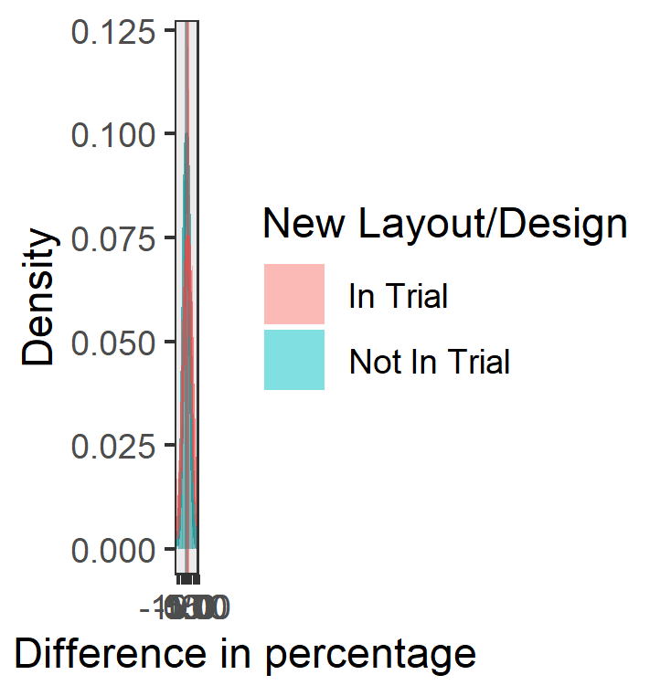
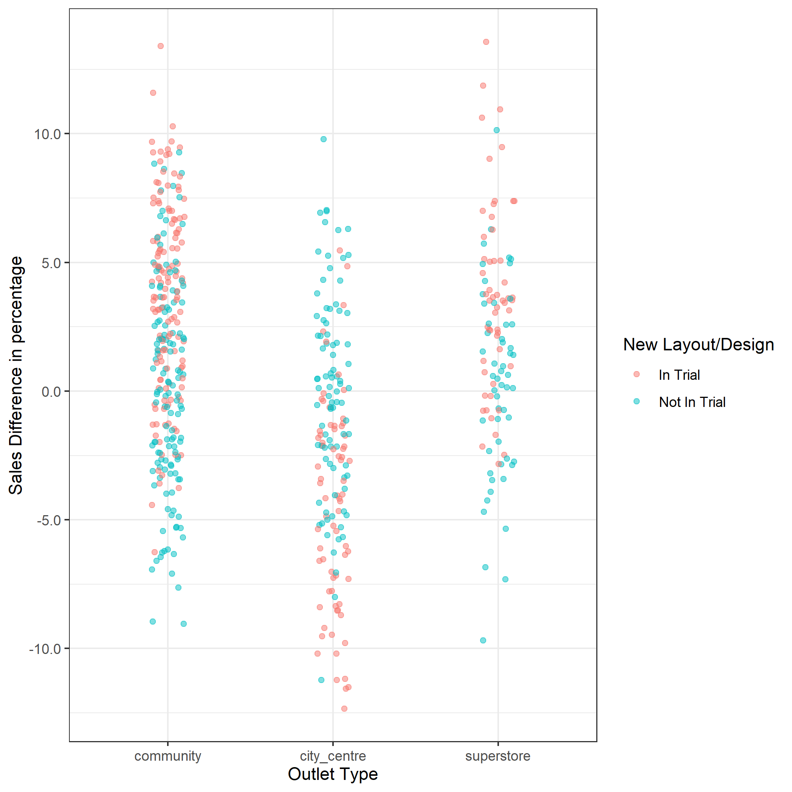
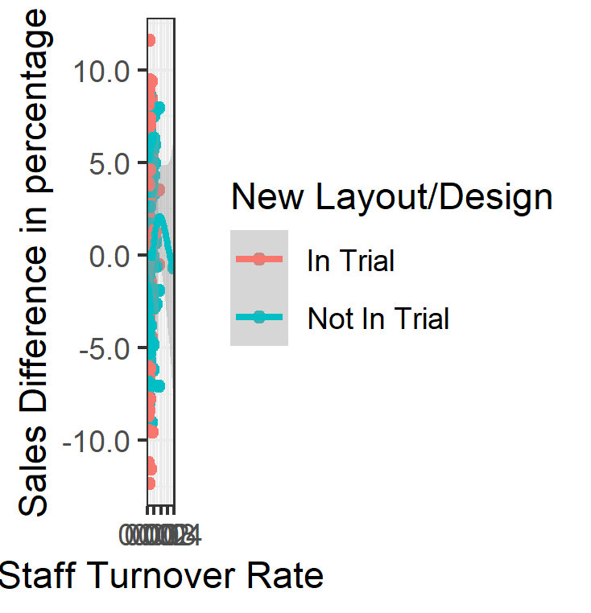

```{r setup}
# import useful packages
library(tidyverse)
library(emmeans)
library(gridExtra)
options(width=100)
```

---

Rename this file and the folder it is in with your student number (e.g., "1912345.Rmd")

Submit this file and the knitted html as a zip file (e.g., 1912345.zip) _by right clicking on the folder to zip it_. That is, the zip file 1912345.zip should contain the folder 1912345 with _only_ the files 1912345.Rmd and 1912345.html

---

# Question 1 Section 1

Figure 1 is the histogram of sales differences of stores in percentage. From period 1 to period 2, the sales difference of stores in trial increases 1.42% 95% CI[0.85% 1.98%]. The sales difference of stores not in trial only increases 0.1% 95% CI[-0.45% 0.65%]. Then, the new layout increases 1.31% 95% CI[0.53%, 2.1%] of sales difference of stores. This improvement is significant, $t(538) = 3.27$, $p = 0.0011$. 

 
Figure 1. A histogram of the sales difference of stores. New design stores and ordinary stores are specified by different colours.


I prefer using **percentage data** while practicing ***ANOVA*** to examine the effect of the new layout. Since some of stores generally have much higher sales than the others, only examining the sales difference is insufficient. For example, the store, whose Outlet_ID is *"EhJV"*, has a fewer sales improvement ($577221.4$ GBP) in GBP than the store *"JI92"* ($684439.4$ GBP). Nonetheless, the original sales of the store *"EhJV"* ($6821444$ GBP) is much lower than that of the store *"JI92"* ($15629310$ GBP). Actually, this store is better as it has a higher increasing rate, $8.46%$. Therefore, I prefer percentage measure while performing ANOVA. 

On the other hand, since each row of sales_1 and sales_2 are the multiple measurements from the same outlet, ***repeated measure ANOVA*** is performed to correctly control the link between sales_1 and sales2. In this case, sales differences are not needed, so I simply use the GBP data here.

---

# Question 2 Section 1
Figure 2 presents the sales difference in percentage by different outlet types. There is a strong interaction between intrial and outlettype, $F(2, 534) = 57.08$. That means a different effect in different outlet types does exist. For **community_convenience** outlets, stores in trial get 3.49% 95% CI[2.56% 4.43%] of sales improvement more than stores without any change, $t(534) = 7.33$, $p < 0.0001$. For **superstores**, stores in trial gets 3.48% 95% CI[2% 4.96%] of sales improvement more than stores not in trial, $t(534) = 4.625$, $p < 0.0001$. However, the pattern of **city_centre_convenience** outlets is different. The percentage of sales difference of stores in trial is 4.39% 95% CI[-5.61% -3.18%] **lower** than that of stores not in trial, $t(534) = -7.11$, $p < 0.0001$. Therefore, the effect of the new store design is negative to **city_centre_convenience** outlets.

 
Figure 2. A scatter plot of the sales difference in percentage by different types of outlets. New design stores and ordinary stores are specified by different colours.

---

Figure 3 shows the relationship between sales difference in percentage and staff turnover rate. It seems that the correlation between these two variables is **not significant** as those two lines vary without any pattern. Actually, **staff_turnover** is not a significant predictor of sales difference in the model, $F(1, 537) = 0.1289$, $p = 0.7197$.


Figure 3. A scatter plot of sales difference by staff turnover rate. New design stores and ordinary stores are specified by different colours.


---

# Question 1 Section 2

Import and prepare the data
```{r}
# Read the data
sales = read_csv("sales_data.csv")
view(sales)
# Check the structure of the data
str(sales)

# Check the levels of the variable "outlettype"
unique(sales$outlettype)

# Create a data frame "sales.short" with correct data structures
sales.short = sales %>%
  mutate(outlettype = factor(outlettype, levels = c("community_convenience", "city_centre_convenience", "superstore")),
         sales_change_GBP = sales_2 - sales_1,
         sales_change_percentage = ((sales_2 - sales_1) / sales_1) * 100,
         intrial = factor(intrial, levels = c(TRUE, FALSE), labels = c("In Trial", "Not In Trial")))
view(sales.short)

# Create a data frame "sales.summary" to store the statistical data
sales.summary = sales.short %>%
  group_by(intrial) %>%
  summarise(n = n(),
            mean.GBP = mean(sales_change_GBP), 
            mean.percentage = mean(sales_change_percentage),
            standard.deviation.GBP = sd(sales_change_GBP),
            standard.deviation.percentage = sd(sales_change_percentage))
view(sales.summary)
```


## Plot
### Exploring GBP measure
Plot a scatter plot for sales difference of stores in GBP by new layout in trial or not. It looks like there is a difference between new design stores and ordinary stores
```{r}
ggplot(data = sales.short, aes(x = intrial, y = sales_change_GBP, col = intrial)) + 
  geom_jitter(width = 0.1, alpha = 0.5) +
  geom_hline(data = sales.summary,
             mapping = aes(yintercept = mean.GBP, col = intrial)) +
  labs(x = "New Store Layout", y = "Sales Difference in GBP", col = "New Layout/Design") +
  theme_bw() +
  annotate(
    "text",
    x = 0.65, y = 3,
    label = paste0("Mean = ", round(sales.summary$mean.GBP[1], 2)),
    vjust = -2.8, size = 2.5, color = "red"
  ) +
  annotate(
    "text",
    x = 2.33, y = 3,
    label = paste0("Mean = ", round(sales.summary$mean.GBP[2], 2)),
    vjust = 1.8, size = 2.5, color = "cyan4"
  ) +
  scale_y_continuous(labels = scales::comma)
```


Plot a histogram for sales difference in GBP by intrial. It seems that there are higher sales for stores in trial. 
```{r message=FALSE}
ggplot(data = sales.short, aes(x = sales_change_GBP, fill = intrial)) + 
  geom_histogram(aes(y = ..density..), alpha = 0.5, position = "identity") +
  theme_bw() +
  stat_function(fun=function(x) {dnorm(x, 
                                       mean=sales.summary$mean.GBP[2],
                                       sd=sales.summary$standard.deviation.GBP[2])}, 
                col="cyan4", alpha = 0.3) +
  geom_vline(xintercept = sales.summary$mean.GBP[2], col="cyan4", alpha = 0.5) +
  stat_function(fun=function(x) {dnorm(x, 
                                       mean=sales.summary$mean.GBP[1],
                                       sd=sales.summary$standard.deviation.GBP[1])}, 
                col="brown1", alpha = 0.3) +
  geom_vline(xintercept = sales.summary$mean.GBP[1], col="brown1", alpha = 0.5) +
  labs(x = "Sales Difference in GBP", y = "Density", fill = "New Layout/Design") +
  scale_x_continuous(labels = scales::comma)
```


Plot a scatter plot for the sales difference in percentage by different outlet types. It looks like new layout and design would lead to higher sales for community_convenience stores and superstores. However, new store layout has a negative effect to the sales to city_centre_convenience stores.
```{r}
ggplot(data = sales.short, aes(x = outlettype, y = sales_change_GBP, col = intrial)) +
  geom_jitter(width = 0.1, alpha = 0.5) +
  theme_bw() +
  labs(x = "Outlet Type", 
       y = "Sales Difference in GBP", 
       col = "New Layout/Design") +
  scale_y_continuous(labels = scales::comma) +
  scale_x_discrete(labels = c("community_convenience" = "community",
                              "city_centre_convenience" = "city_centre"))
  
```


Plot a scatter plot to check the relationship between sales difference and staff turnover rate. It seems that the correlation between these two variables is not significant
```{r}
ggplot(data = sales.short %>% filter(staff_turnover != 0), 
       aes(x = staff_turnover, y = sales_change_GBP, col = intrial)) +
  geom_point() +
  theme_bw() +
  geom_smooth() +
  labs(x="Staff Turnover Rate", y="Sales Difference in GBP", col = "New Layout/Design") +
  scale_y_continuous(labels = scales::comma)
```


### Exploring percentage measure
Plot a scatter plot for percentage of sales difference of stores by new layout in trial or not. It looks like the average of sales difference of stores in trial is slightly higher than that of stores not in trial
```{r}
ggplot(data = sales.short, aes(x = intrial, y = sales_change_percentage, col = intrial)) + 
  geom_jitter(width = 0.1, alpha = 0.5) +
  geom_hline(data = sales.summary,
             mapping = aes(yintercept = mean.percentage, col = intrial)) +
  labs(x = "New Store Layout", y = "Sales Difference in percentage", col = "New Layout/Design") +
  theme_bw() +
  annotate(
    "text",
    x = 0.65, y = 3,
    label = paste0("Mean = ", round(sales.summary$mean.percentage[1], 2)),
    vjust = 1, size = 2.5, color = "red"
  ) +
  annotate(
    "text",
    x = 2.33, y = 3,
    label = paste0("Mean = ", round(sales.summary$mean.percentage[2], 2)),
    vjust = 7, size = 2.5, color = "cyan4"
  ) +
  scale_y_continuous(labels = scales::comma)
```


Plot a histogram for sales difference in percentage by intrial. It seems that there are higher sales for stores in trial. 
```{r message=FALSE}
( sales.difference.in.percentage.histogram = ggplot(data = sales.short, 
                                                  aes(x = sales_change_percentage, fill = intrial)) + 
  geom_histogram(aes(y = ..density..), alpha = 0.5, position = "identity") +
  # geom_histogram(alpha = 0.5, position = "identity") +
  theme_bw() +
  stat_function(fun=function(x) {dnorm(x, 
                                       mean=sales.summary$mean.percentage[2],
                                       sd=sales.summary$standard.deviation.percentage[2])}, 
                col="cyan4", alpha = 0.4) +
  geom_vline(xintercept = sales.summary$mean.percentage[2], col="cyan4", alpha = 0.5) +
  stat_function(fun=function(x) {dnorm(x, 
                                       mean=sales.summary$mean.percentage[1],
                                       sd=sales.summary$standard.deviation.percentage[1])}, 
                col="brown1", alpha = 0.4) +
  geom_vline(xintercept = sales.summary$mean.percentage[1], col="brown1", alpha = 0.5) +
  labs(x = "Sales Difference in percentage", y = "Density", fill = "New Layout/Design") +
  scale_x_continuous(labels = scales::comma) )
```


Save the plot
```{r}
ggsave(sales.difference.in.percentage.histogram, file="sales.difference.in.percentage.histogram.png")
```


Plot a scatter plot for the sales difference in percentage by different outlet types. It looks like new layout and design would lead to higher sales for community_convenience stores and superstores. However, new store layout statistically produce a negative effect to the sales for city_centre_convenience stores.
```{r}
( sales.difference.by.outlettype.and.intrial = ggplot(data = sales.short, 
                                                      aes(x = outlettype, 
                                                          y = sales_change_percentage, 
                                                          col = intrial)) +
  geom_jitter(width = 0.1, alpha = 0.5) +
  theme_bw() +
  labs(x = "Outlet Type", 
       y = "Sales Difference in percentage", 
       col = "New Layout/Design") +
  scale_y_continuous(labels = scales::comma) +
  scale_x_discrete(labels = c("community_convenience" = "community",
                              "city_centre_convenience" = "city_centre")) )
  
```


Save the plot
```{r}
ggsave(sales.difference.by.outlettype.and.intrial, file="sales.difference.by.outlettype.and.intrial.png")
```


Plot a scatter plot to check the relationship between sales difference in percentage and staff turnover rate. It seems that the correlation between these two variables is not significant as those two lines vary without any pattern
```{r}
( sales.difference.by.staffturnover.and.intrial = ggplot(data = sales.short %>% 
                                                         filter(staff_turnover != 0), 
       aes(x = staff_turnover, y = sales_change_percentage, col = intrial)) +
  geom_point() +
  theme_bw() +
  geom_smooth() +
  labs(x="Staff Turnover Rate", y="Sales Difference in percentage", col = "New Layout/Design") +
  scale_y_continuous(labels = scales::comma) )
```


Save the plot
```{r}
ggsave(sales.difference.by.staffturnover.and.intrial, file="sales.difference.by.staffturnover.and.intrial.png")
```


## Exploring the effect of new layout/design
### Model1: Using GBP data
```{r}
# Build a linear model of sales_change_GBP by intrial
m.GBP.sales.intrial = lm(sales_change_GBP~intrial, data = sales.short)
# Use anova to check the significance of predictor "intrial"
anova(m.GBP.sales.intrial)
```

```{r}
# Check the outcome of the model "m.GBP.sales.intrial"
summary(m.GBP.sales.intrial)
```
The new store layout/design **significantly** changes average sales in GBP, $t(538) = -5.775$, $p < 0.0001$


```{r}
# Check the individual means and confidence intervals for each category
( GBP.sales.intrial.emm = emmeans(m.GBP.sales.intrial, ~intrial) )
```


contrast
```{r}
# Set up the contrast tibble
Trial.notTrial.GBP.contrast = tibble(Trial.minus.notTrial = c(1, -1))

# Hypothesis Testing
( contrast(GBP.sales.intrial.emm, Trial.notTrial.GBP.contrast) )
# Estimation
( GBP.sales.intrial.confint = confint(contrast(GBP.sales.intrial.emm, Trial.notTrial.GBP.contrast)) )
```
The sale increase of stores in trial is 408804 GBP 95% CI[269755, 547853] higher than that of stores not in trial, $t(538) = 5.78$, $p < 0.0001$.


Presentation 
```{r}
ggplot(summary(GBP.sales.intrial.emm), 
       aes(x = intrial, y = emmean, ymax = upper.CL, ymin = lower.CL)) +
  geom_point() +
  geom_linerange() +
  labs(x = "New Layout/Signage", y = "Sales Difference (GBP)", subtitle="Error Bars are Extent of 95% CIs") +
  geom_hline(yintercept = 0, linetype = "dashed")
```

The figure shows the sales difference in GBP from each type of stores. Sales difference of stores in trial is higher than sales difference of stores not in trial.


### Model2: Using Percentage data
```{r}
# Build a linear model of sales_change_percentage by intrial
m.per.sales.intrial = lm(sales_change_percentage~intrial, data = sales.short)
# Use anova to check the significance of predictor "intrial"
anova(m.per.sales.intrial)
```

```{r}
# Check the outcome of the model "m.per.sales.intrial"
summary(m.per.sales.intrial)
```
The new store layout/design significantly changes average sales in percentage, $t(538) = -3.27$, $p = 0.001$


```{r}
# Check the individual means and confidence intervals for each category
( per.sales.intrial.emm = emmeans(m.per.sales.intrial, ~intrial) )
```


contrast
```{r}
# Set up the contrast tibble
Trial.notTrial.per.contrast = tibble(Trial.minus.notTrial = c(1, -1))

# Hypothesis Testing
( contrast(per.sales.intrial.emm, Trial.notTrial.per.contrast) )
# Estimation
( confint(contrast(per.sales.intrial.emm, Trial.notTrial.per.contrast)) )
```
The percentage of sale increase of stores in trial is 1.31% 95% CI[0.53%, 2.1%] higher than the percentage of sale increase of stores not in trial, $t(538) = 3.27$, $p = 0.0011$.


Presentation
```{r}
ggplot(summary(per.sales.intrial.emm), 
       aes(x = intrial, y = emmean, ymax = upper.CL, ymin = lower.CL)) +
  geom_point() +
  geom_linerange() +
  labs(x = "New Layout/Signage", y = "Sales Difference (Percentage)", subtitle="Error Bars are Extent of 95% CIs") +
  geom_hline(yintercept = 0, linetype = "dashed")
```

The figure shows the sales difference in percentage from each type of stores. Sales difference of stores in trial is higher than sales difference of stores not in trial.


## Controlling the link between sales_1 and sales_2 
Each row of sales_1 and sales_2 are the multiple measurements from the same outlet.
### Create a longer dataset
```{r}
# Create a longer dataset to gather the variable "sales_1" and the variable "sales_2"
sales.long = pivot_longer(sales, c(sales_1, sales_2), 
                          names_to = "Period", 
                          values_to = "Sales", 
                          names_transform = list(Period = factor, 
                                                 Sales = as.numeric), 
                          names_prefix = "sales_") %>%
  mutate(outlettype = factor(outlettype, levels = c("community_convenience", "city_centre_convenience", "superstore")),
         intrial = factor(intrial, levels = c(TRUE, FALSE), labels = c("In Trial", "Not In Trial")))
view(sales.long)
```


### Model3: Repeated Measure ANOVA
```{r}
contrasts(sales.long$Period) = contr.sum
# Repeated Measure ANOVA
m.sales.period = aov(Sales~Period*intrial + Error(Outlet_ID/Period), 
                             data = sales.long)
# Check the outcome of the model "m.sales.period"
summary(m.sales.period)
```
The effect of period is significant, $F(1, 538) = 37.68$, $p < 0.0001$.
The effect of period does interact with intrial, $F(1, 537) = 33.35$, $p < 0.0001$.


```{r}
# Check the individual means and confidence intervals for each category (Period + intrial)
( sales.period.emm = emmeans(m.sales.period, ~Period + intrial) )
```


Contrast
```{r}
# Set up the contrast tibble
Period.contrast = tibble(Period2.minus.Period1 = c(-1, 1, 1, -1))
# Hypothesis Testing
( contrast(sales.period.emm, Period.contrast) )
# Estimation
( confint(contrast(sales.period.emm, Period.contrast)) )
```
The sales difference for stores in trial is 408804 GBP 95% CI[269755, 547853] higher than the sale difference for stores not in trial, $t(538) = 5.775$, $p-value < 0.0001$.


---

# Question 2 Section 2
## The different effect in different outlet types
### Model4: Interaction between intrial and outlettype
```{r}
# Build a linear model for sales_change_percentage by intrial, outlettype and the interaction between intrial and outlettype
m.sales.intrial.outlettype = lm(sales_change_percentage~intrial*outlettype, data = sales.short)
# Implement ANOVA to check the significance of the interaction between intrial and outlettype in the model
anova(m.sales.intrial.outlettype)
```
The effect of new layout of stores significantly differs across different outlet types, $F(2, 534) = 31.091$, $p < 0.0001$.


### Interpret the different effect in different outlet types
```{r}
# Check the individual means and confidence intervals for each category (intrial + outlettype)
( sales.intrial.outlettype.emm = emmeans(m.sales.intrial.outlettype, ~intrial + outlettype) )
```

contrast
```{r}
# Set up the contrast tibble
outlet_contrast = tibble(community_convenience = c(1, -1, 0, 0, 0, 0), 
                         city_centre_convenience = c(0, 0, 1, -1, 0, 0), 
                         superstore = c(0, 0, 0, 0, 1, -1))
# Hypothesis Testing
( contrast(sales.intrial.outlettype.emm, outlet_contrast) )
# Estimation
( outlet_confint = confint(contrast(sales.intrial.outlettype.emm, outlet_contrast)) )
```

### Presentation
```{r}
p2.1 = ggplot(summary(sales.intrial.outlettype.emm), 
       aes(x = intrial, y = emmean, ymax = upper.CL, ymin = lower.CL, group = desc(outlettype))) +
  geom_point() +
  geom_linerange() +
  labs(x = "New Layout/Signage", 
       y = "Sales Difference (GBP)", 
       title = "Sales changed in GBP by intrial in different types of outlet") +
  facet_grid(.~outlettype) +
  geom_hline(yintercept = 0, col = "green")


outlet_confint = outlet_confint %>%
  mutate(contrast = factor(contrast, levels = c("community_convenience", "city_centre_convenience", "superstore")))
p2.2 = ggplot(outlet_confint, 
       aes(x = contrast, y = estimate, ymax = upper.CL, ymin = lower.CL, group = contrast)) +
  geom_point() +
  geom_linerange() +
  labs(x = "Outlet types",
       y = "Difference sales improvement",
       title = "Difference sales improvement in different types of outlet") +
  geom_hline(yintercept = 0, col = "green")

grid.arrange(p2.1, p2.2, ncol = 1)
```


## Staff Turnover
### The improvement for adding staff turnover (without the interaction between intrial and outlettype)
```{r}
# Build a linear model for sales_change_percentage by intrial and staff_turnover
m.per.sales.intrial.staff_turnover = lm(sales_change_percentage~intrial+staff_turnover, data = sales.short)
# Use anova to check if the variable "staff_turnover" is a significant predictor
anova(m.per.sales.intrial, m.per.sales.intrial.staff_turnover)
```
*staff_turnover* is not a significant predictor of sales_change_percentage in the model, $F(1, 537) = 0.1289$, $p = 0.7197$


### The improvement for adding staff turnover (with the interaction between intrial and outlettype)
```{r}
# Build a linear model for sales_change_percentage by intrial, outlettype, the interaction between intrial and outlettype, and staff_turnover
m.sales.intrial.outlettype.staff_turnover = lm(sales_change_percentage~intrial*outlettype + staff_turnover, 
                                               data = sales.short)
# Use anova to check if the variable "staff_turnover" is a significant predictor
anova(m.sales.intrial.outlettype, m.sales.intrial.outlettype.staff_turnover)
```
*staff_turnover* is not a significant predictor of sales_change_percentage in the model, $F(1, 533) = 0.3429$, $p = 0.5584$

*staff_turnover* in both models is not a significant predictor.
